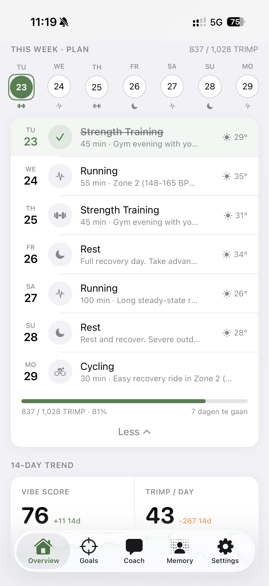
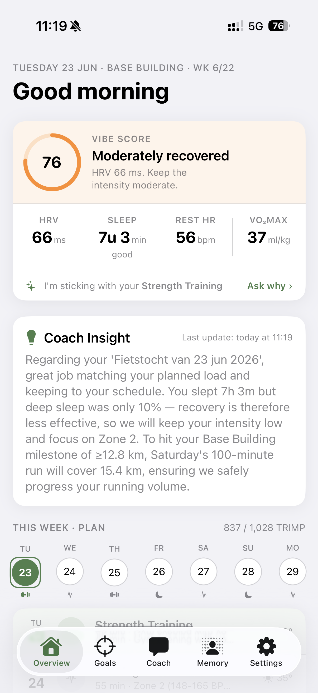
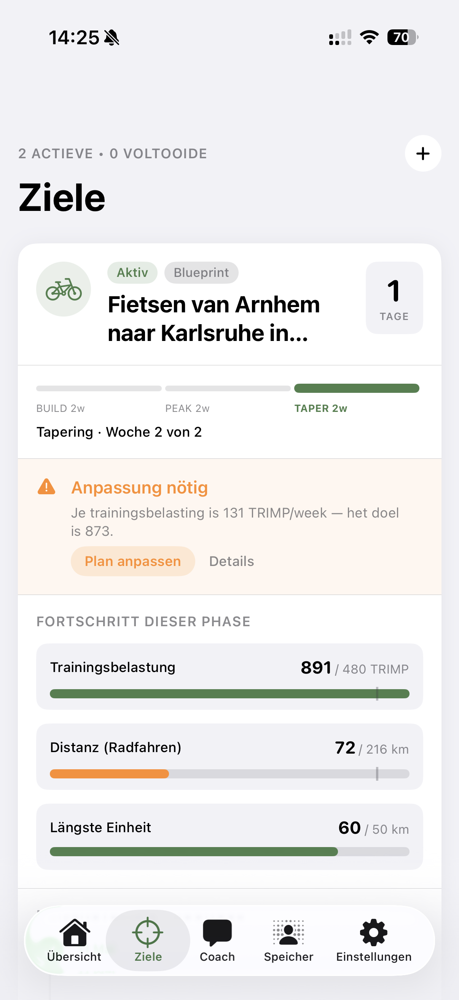
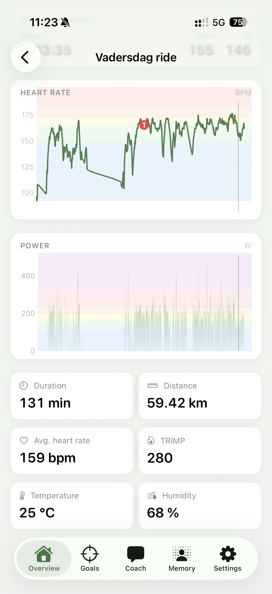
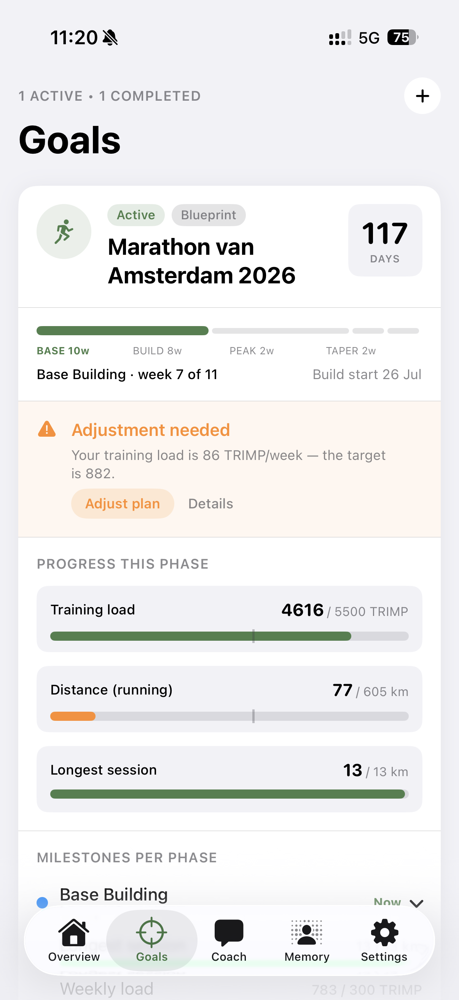
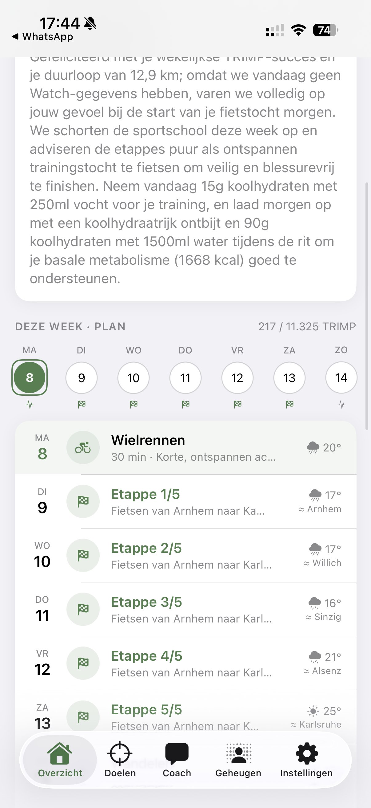
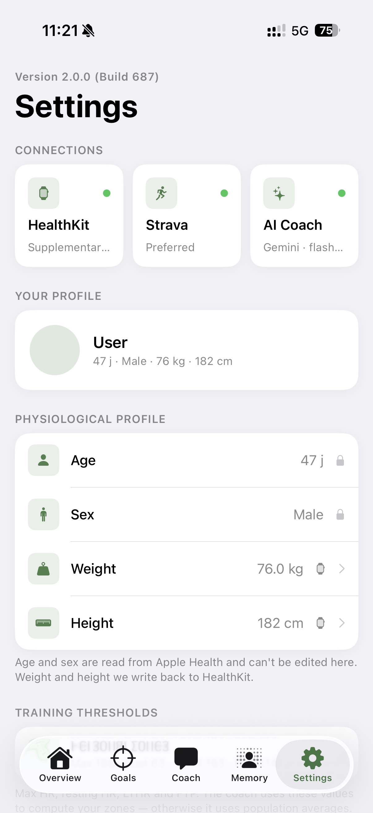
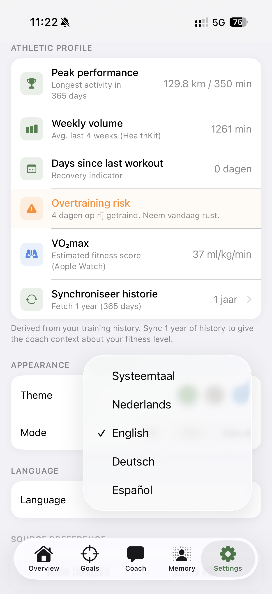

<div align="center">

# VibeCoach



**A personal, physiologically-aware fitness coach for iOS.**

VibeCoach combines Apple HealthKit, Strava and your choice of AI model (Gemini · OpenAI · Claude · Mistral) to read how your body is actually responding — and adjust your training before you over- or under-do it.

</div>

---

## Why VibeCoach

Most training apps log what you did. VibeCoach reads what it *means*: it scores your readiness from sleep and HRV, recognises fatigue patterns inside a single workout, and only speaks up when something is off — always with a concrete plan, never just a red dot.

It runs entirely on your own data and your own AI key. HealthKit stays on device; the AI key lives in the Keychain; nothing is sold or shared.

---

## What it does for you

### 🟢 Vibe Score — know if today is a green light



A single 0–100 readiness score, computed locally from your sleep (including deep/REM stages) and your HRV measured against your own 7-day baseline. It sits at the top of the dashboard and is fed into every coaching decision.

**What you get:** one glance tells you whether to push or to back off — grounded in your physiology, not a generic calendar.

<br clear="right">

### 🔔 Proactive coaching — it warns you, not nags you



VibeCoach follows *Management by Exception*: it stays quiet when things are fine and only reaches out on a real deviation — training too hard while you're under-recovered, or sitting still while a goal slips into the red. A red status **always** comes with an AI-generated recovery plan.

**What you get:** no notification spam — just a timely heads-up with a fix, when it actually matters.

<br clear="left">

### 💬 AI coach in your pocket — bring your own model


Chat with a coach that already knows your readiness, recent workouts, goals and training phase. Pick your provider — **Gemini, OpenAI, Claude or Mistral** — with your own key and your own model selection, behind one provider-agnostic layer.

**What you get:** real, context-aware advice in your language, with full control over which AI you trust and what it costs.

<br clear="right">

### 📈 Workout deep-dive — the story behind the numbers



Beyond averages: VibeCoach reads the raw time-series of a workout and detects aerobic decoupling, cardiac drift, cadence fade and slow HR recovery — annotated right on the chart, with a short AI synthesis of what they mean together.

**What you get:** you find out *why* a session felt hard — heat, fatigue, going too deep — instead of guessing.

<br clear="left">

### 🎯 Goals in phases — what to hit, and when



Each goal is broken into training phases (Base · Build · Peak · Taper). Every phase shows its date range, targets and key milestones in a collapsible section, so you always know what you should reach by when.

**What you get:** a clear, dated path to your event — not one distant finish line.

<br clear="right">

### 🗺️ Multi-day events & weather along the route



Planning a multi-day tour (e.g. "Cycle from Arnhem to Karlsruhe in 5 days")? VibeCoach models it as stage days in your week schedule, suppresses conflicting training in that window, and shows a weather forecast for roughly *where you'll be each day* — derived from the route in your goal title.

**What you get:** an event plan that respects the actual days on the road, with weather that matches your location, not your couch.

<br clear="left">

### 🔄 Dual-source sync — HealthKit + Strava, no double counting



HealthKit and Strava run side by side, always on. Smart-ingest and automatic dedupe make sure a richer record (Strava with power) is never overwritten by a poorer one (HealthKit without power) for the same activity.

**What you get:** one clean training history, automatically, whichever app you started the workout in.

<br clear="right">

### 🌍 Your language, your data



The whole UI and the AI coach speak **Dutch, English, German or Spanish** — selectable in Settings (default: your device language). And it's privacy-first by design: HealthKit data never leaves the device, AI keys live in the Keychain, and the Strava secret lives in a Cloudflare Worker, never in the app.

**What you get:** a coach that talks to you naturally, on data that stays yours.

<br clear="left">

---

## Under the hood

A short technical summary; the full picture lives in the linked docs (no duplication — see [`CLAUDE.md`](CLAUDE.md) §7).

| Layer | Choice |
|------|-------|
| **Platform** | iOS 17+ (macOS + Xcode 16 required to build) |
| **UI & data** | SwiftUI + SwiftData (strict enums — `SportCategory`, `EventFormat`, `TrainingPhase` — no raw strings) |
| **AI** | BYOK multi-provider — Gemini (default), OpenAI, Claude or Mistral; per-provider key + live-fetched model catalog |
| **Health data** | Apple HealthKit (HRV, sleep + stages, workouts) + optional Strava OAuth2 via a Cloudflare Worker |
| **Weather** | Open-Meteo API (free, no key) via CoreLocation + URLSession |
| **Background** | `HKObserverQuery` (Engine A: reacts to new workouts) + `BGAppRefreshTask` (Engine B: daily inactivity check) |
| **Testing** | XCTest + XCUITest — **61% combined coverage on testable code** (Models 80%, Services 59%, ViewModels 59%) + 43% on `Views/` via UI tests |

**Core principles**

- **Management by Exception** — only warn on deviations; a red status always ships with an AI recovery plan.
- **Privacy-first** — HealthKit on device, AI keys in Keychain, Strava secret in the Worker.
- **Type-safe** — SwiftData with strict enums; external data mapped to enums at the front door.

**CI:** a 4-job DAG (`SwiftLint` / Unit Tests / UI Tests / Coverage Report) on `macos-latest`, plus a CodeQL scan of Swift + Actions workflows and a `release-please` workflow that cuts semver tags + GitHub Releases from Conventional Commits.

**Recently completed:** Epic #60 (per-phase milestone insight in the Goals view), #57 (one-tap post-workout RPE check-in), #56 (location-aware per-stage weather), #55 (multi-day events first-class), #37 (internationalisation NL/EN/DE/ES), #53/#54 (multi-provider BYOK + dynamic model catalog), #32 (deep-dive physiological analysis). Open work → [`docs/ROADMAP.md`](docs/ROADMAP.md) · full history → [`docs/ROADMAP-archive.md`](docs/ROADMAP-archive.md).

**Dig deeper:**

- 🏗️ Architecture (Dual Engine, dual-source pipeline, BYOK, CI) → [`docs/ARCHITECTURE.md`](docs/ARCHITECTURE.md)
- 🗺️ Interactive architecture viewer → **[open rendered](https://htmlpreview.github.io/?https://github.com/markclausing/vibecoach/blob/main/docs/architecture/architecture.html)** (GitHub shows `.html` as source, so this opens it via htmlpreview) · [source](docs/architecture/architecture.html)
- 🗒️ Open & planned work → [`docs/ROADMAP.md`](docs/ROADMAP.md) (lean live plan)
- 📜 Full epic history → [`docs/ROADMAP-archive.md`](docs/ROADMAP-archive.md) (completed epics, append-only)
- 🤖 Rules for AI assistants & contributors → [`CLAUDE.md`](CLAUDE.md)

---

## Build & run it yourself

VibeCoach is open source. To run your own build:

1. **Requirements:** macOS with **Xcode 16**, and an **iPhone on iOS 17+** (a physical device is strongly recommended — HealthKit is limited in the simulator).
2. **Clone & open** `AIFitnessCoach.xcodeproj` in Xcode.
3. **Secrets:** copy `Secrets-template.swift` to `Secrets.swift` and fill in your values (`stravaClientID`, `stravaProxyBaseURL`, `stravaProxyToken`). Strava is **optional** — without it the app runs HealthKit-only. The Strava `client_secret` is never in the app; it lives as a Cloudflare Worker secret in [vibecoach-proxy](https://github.com/markclausing/vibecoach-proxy).
4. **Build & run** on your device or a simulator (Cmd+R).
5. **Add your AI key:** open **Settings → AI provider**, pick a provider (Gemini / OpenAI / Claude / Mistral) and paste your own API key. The key is stored in the Keychain. The coach is inactive until a key is set.
6. *(Optional)* **Connect Strava** from Settings to add a second data source alongside HealthKit.

**Run the tests:** select the `AIFitnessCoach` scheme and press Cmd+U, or build from the command line with `xcodebuild test`. Unit tests cover the pure-Swift logic in `Services/`, `Models/` and `ViewModels/`; UI tests cover the happy-path flows. See [`CLAUDE.md`](CLAUDE.md) §6 for the testing policy.

### Developer notes

<details>
<summary>Testing local push notifications in the simulator</summary>

Create a `test-push.apns` file and drag it onto the running simulator:

```json
{
  "Simulator Target Bundle": "com.markclausing.aifitnesscoach",
  "aps": {
    "alert": {
      "title": "Goal in the red",
      "body": "Your weekly Marathon TRIMP is falling behind — check your recovery plan."
    },
    "badge": 1,
    "sound": "default"
  },
  "type": "goalRisk"
}
```

The `type` value must be on the M-08 whitelist (`goalRisk` or `recovery_plan`), otherwise the notification is silently ignored.

</details>

---

## Contributing & workflow

See [`CLAUDE.md`](CLAUDE.md) for the full rules. In short:

- Every code change goes through a branch + PR — never directly on `main`.
- Branch names: `feature/epic-{nr}-...`, `fix/...`, `security/...`, `ci/...`, `chore/...`.
- One fix per PR. Docs belong in the same commit as the feature.
- New features get XCTest coverage; happy paths get an XCUITest.
